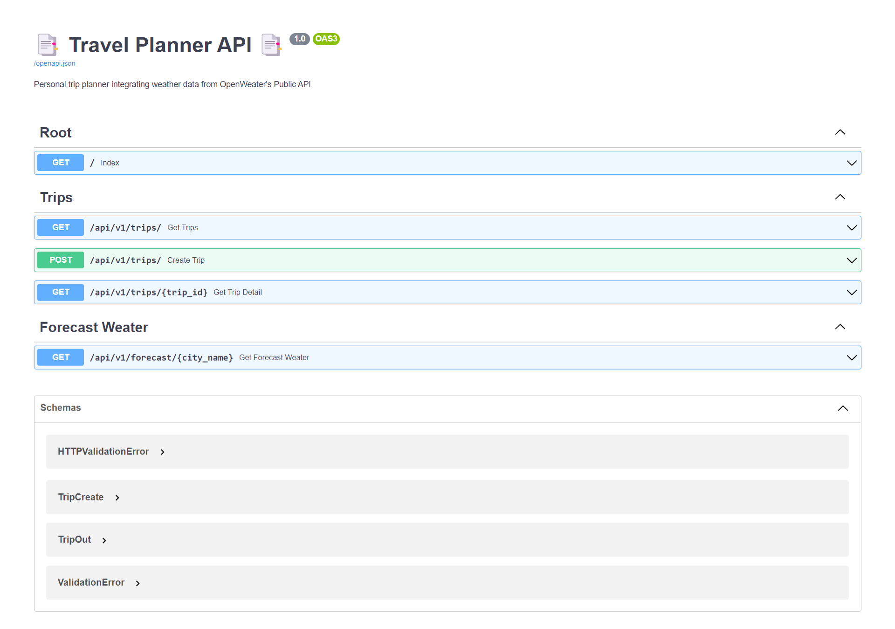
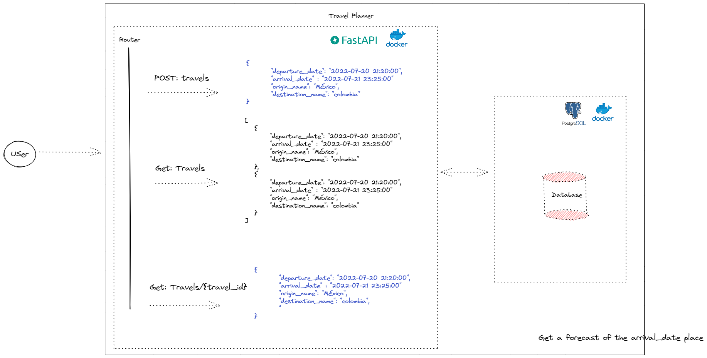
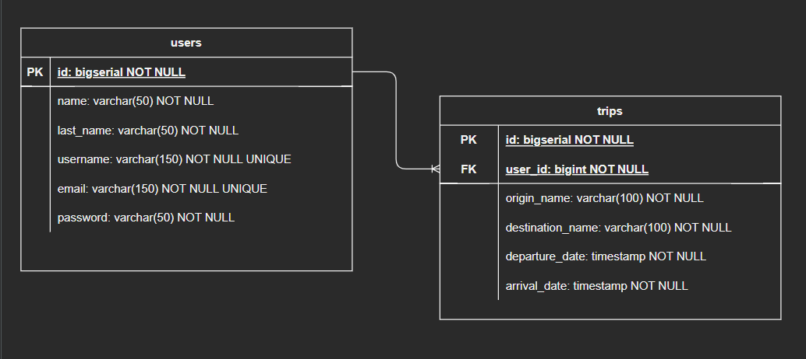

<h1 align="center" id="title">📑 Travel Planner 📑</h1>

⛈️🌤️ Personal trip planner integrating weather data from OpenWeater's Public API

## Table of Contents
- [Table of Contents](#table-of-contents)
- [🚀 Demo](#-demo)
- [System Design](#system-design)
- [Entity-Relationship Diagram](#entity-relationship-diagram)
- [Database SQL](#database-sql)
- [💡Features](#features)
- [🧑‍💻 Installation Steps](#-installation-steps)
- [The process](#the-process)
  - [🏗️ Build with](#️-build-with)
- [Licence](#licence)
- [Author](#author)

## 🚀 Demo

## System Design

## Entity-Relationship Diagram

In order to see the application I created my own relationship model, identifying a one-to-many relationship between users and trips.

Managing a foreign key user_id for the connection between the users table to the trips table.

Why all NOT NULL?
Users: In users I limited to place only basic fields, but of relevance of the users, getting to restrict some as unique as are the user name and mail, as this way I make sure not to have duplicity in this table.

trips: In trips, having to know when and where a person leaves a place and where he will arrive and his arrival date, I knew I could not build a trip without this information.

In the case of the dates I handled them in timestamp format to know the date and time of departure and arrival of the traveler, since a restriction is that the entire trip can not last more than 8 days equivalent to (192 hours), then a solution that could be implemented, would be through a query to make a summation of the total time of the trips and if it exceeds the limit of 192 to alert the user that the travel time is going to be exceeded.

## Database SQL
My bases for choosing a related database are:
- I have knowledge of the types of data I am going to store, plus they are related to each other.
- Besides being able to relate more entities:
  - example: that I can link a trip with types of transports I will use or the type of luggage I should carry per trip would be superb.
- I have a better understanding of how they work and they allow me to be flexible with queries.

## 💡Features
Here're some of the projects's best features:
- Endpoint to retrive all the travels ✅
- Endpoint to retrive the detail of a travel ✅
- Endpoint to create a travel ✅
- Endpoint to retrive weater forecast ✅
- Implementation of container technologies ✅

## 🧑‍💻 Installation Steps
1. Clone the repository
2. Create your virtual enviromen with the command `py -m venv venv`
3. Install requirements in your virtual enviroment `pip install -r requirements.txt`
4. Create the env file in the root of the project `.env` and copy the content of the `.env.example` to configurate environment variables.
5. Note: if you want to consult the forecast by city, I recommend you to register in the platforma [OpenWeater](https://openweathermap.org/api/one-call-3), get and API KEY and add in you file .env to access to this infromation.

6. You can run the following command to buil the image. `$ docker-compose build`

7. Once the image is built, run the container: `$ docker-compose up -d`

8. If you want to be faster in launching the project you can use the following command to perform the above two steps in one. `$ docker-compose up --build`
8. Now go to http://127.0.0.1:8000/docs and enjoy the app.
##  The process
### 🏗️ Build with
Technologies used in this project:

- [Docker](https://www.docker.com/) 🐋
- [Python](https://www.python.org/) 🐍
- [FastAPI](https://fastapi.tiangolo.com/) 🚀
- [Pydantic ](https://pydantic-docs.helpmanual.io/) 💯
- [PostgreSQL](https://www.postgresql.org/) 🐘
- [SQLAlchemy](https://www.sqlalchemy.org/) ⚙️

To get started you just need to download docker on your machine, I leave the link right here. ➡️ [Docker](https://www.docker.com/get-started "Docker").

## Licence
> This project is licensed under the MIT License

## Author
Made with 💙 by [javieramayapat](https://www.linkedin.com/in/javieramayapat/)